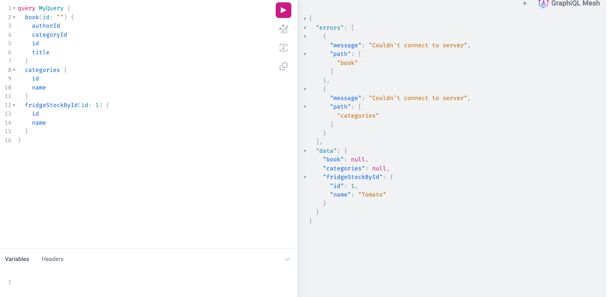
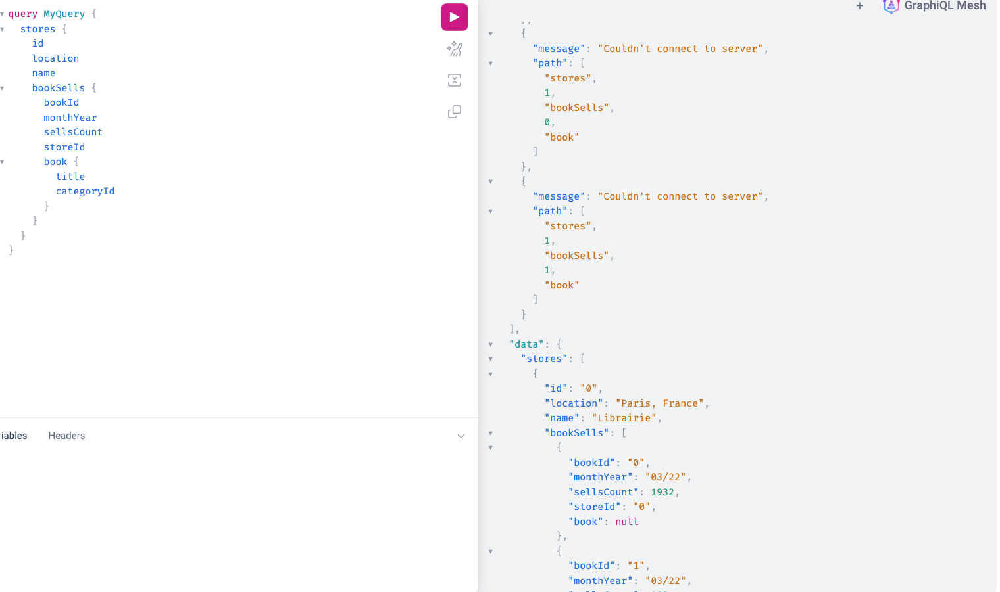
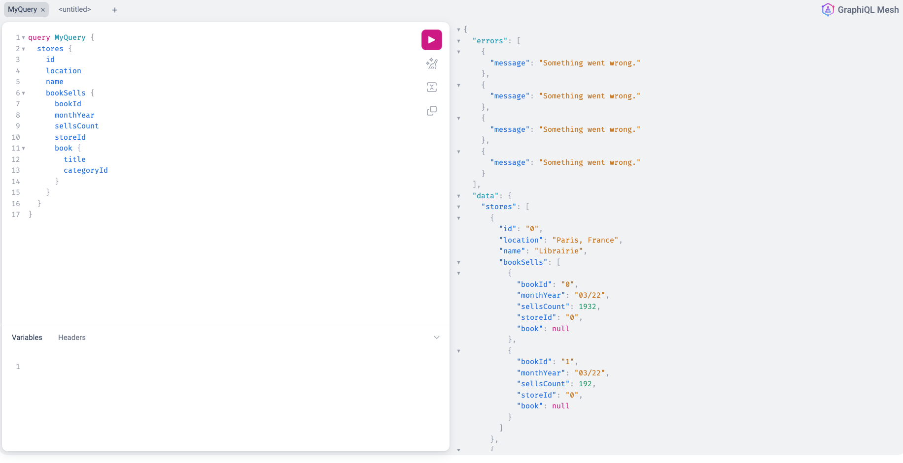
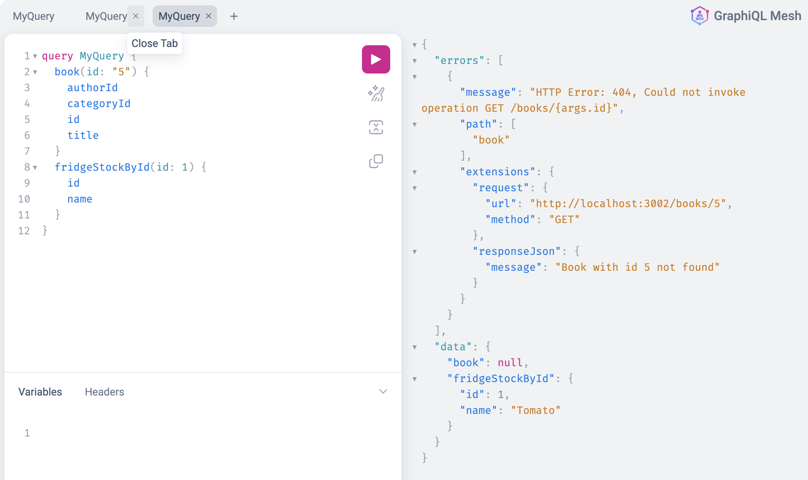

# graphql-mesh

## error case

### 並列に呼び出し

### マージしたクエリ

### Errors maskingを使った場合

[Enabling Error masking](https://the-guild.dev/graphql/mesh/docs/guides/error-masking#enabling-errors-masking)

### 404エラーの時

